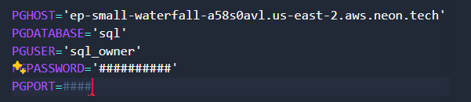

## Authors 
Part 1, 2, 3
- Daniel Calle
- Dilan Urrego

Part 4
- Steven Oviedo
- Sara Moncada

**Part 5**
- Mario Andrade
- Paula Meneses

## What is it and what is it for?
- The Naval Battle game is a strategy game in which the objective is to sink the opponent's ships (in this case the machine) by guessing their locations on a board.
- The Naval Battle game in single mode provides a challenge of logic and strategy, since the player must deduce the position of enemy ships based on the results of their shots. Furthermore, it is entertaining and can improve the player's logical reasoning and decision-making abilities.

## How do I make it work?
- **Prerequisites:**
Install Python: Make sure you have Python installed on your system. You can download and install it from python.org.

- **Libraries:** The libraries used for this development are "random" and "kivy", "random" is included by default in pyhon; you must install "kivy" to be able to run the application from a graphical interface.

- **Execution of the game on console:**
Navigate to the folder: Once you have cloned the repository, open cmd and look for the following path that contains the folder with the file:
```src\view\console\NavalBattleConsole.py```

- **Execution of the Database in console:**
Navigate to the folder: Once you have cloned the repository, open cmd and look for the following path that contains the folder with the file:
```src\view\console\Menu_Console_DB.py```

- **Execution of the game in kivy graphical interface:**
Navigate to the folder: Once you have cloned the repository, open cmd and look for the following path that contains the folder with the file:
```src\view\GUI\NavalBattle-gui.py```

- ## **Execution of the Database in a web application**
Find the main file: Once you have cloned the repository, open cmd and look for the following file:
```naval_battle_web.py```

**Libraries for the web application:** The libraries used for this development are "psycopg2", "sqlite3" and "flask", to install them run through the console:

- ```pip install psycopg2```

- ```pip install flask```

- ```pip install sqlite3```

When you run the main file, it will give you a link that you must copy and paste into the browser of your choice to view the web application.
For example:

```* Running on http://127.0.0.1:5000```


In the web application you can choose how you want to manipulate the game games:
- Insert
- Search
- Delete
- Modify

## How do I make the database work?

**Prerequisites:** Make sure you have an account in Neon Console (https://console.neon.tech/), so you can have your respective access information.

Perform the following steps to configure the Database connection:

1. Duplicate the file ``` Secret_Config-sample.py``` and rename it ``` Secret_Config.py``` . Then, replace your NeonTech database connection data into this new file (SecretConfig.py).
Example:



2. Install the psycopg2 package using the following command:

```pip install psycopg2```

3. Install sqlite3 with the following command:

```pip install sqlite3```


##How is it made?

**Project Architecture:**

- **Custom Classes and Exceptions:**

The project defines several custom exceptions to handle specific errors related to game setup and execution, such as NotEnoughSpace, BoardIsTooSmall, BoardIsTooBig, InvalidCoordinate, among others.

- *Main Class - NavalBattle:* This is the main class that manages all the logic of the game.

- *Main Execution:* In the if __name__ == "__main__": block, the program interacts with the user to set the size of the board and the number of ships, and then allows the player to fire until all enemy ships are sunken

- *Libraries Used:* random: Used to generate random positions for ships on the board.

- *Dependencies on Other Projects:* There are no external dependencies on other projects or additional libraries beyond custom exceptions and the random standard library. The entire game is contained within a single class and set of custom exceptions defined in the same script.

**Organization of the Modules:**
*Main Folder: "NAVAL BATTLE"*

Contains essential files and folders for the project.

- ```.gitignore:``` Defines which files or folders should be ignored by the version control system (Git).

- ```LICENSE:``` Contains the project license, specifying the terms of use, distribution and contribution.

- ```__init__.py:``` Allows the folder to be treated as a Python package, making it easier to import internal modules.
- ```__pycache__:``` Automatically generated folder by Python to store compiled bytecode (.pyc) files, which improves module loading speed.

- ```SecretConfig_Sample.py:``` From this file you should guide yourself to create your "SecretConfig.py" file with your information for creating tables in the database.


## Project structure (MVC)

- **src folder:**
This folder contains the source code of the project, divided into organized modules.
Subfolders:

1.*Model*

- **Logic:** Contains the main implementation of the Naval Battle game, including classes and logic related to board management, ship placement, and game mechanics.

- **databaseconnection:** It is responsible for the logic related to managing the connection to the database and the creation of new games.

- **NavalBattleModel**: Contains the menu logic that allows you to perform operations related to the game database.


2. *Controller:*

- **NavalBattleController.py:** File that is responsible for acting as an intermediary between the game logic and the user interface (both console and GUI)

- **CRUD:** Folder that contains the database management logic (Insert, Delete, Update and Search)

3. *View:*

#### Console
- **Menu_Console_DB.py**: Contains the menu logic that allows you to perform operations related to the game database.

- **NavalBattleConsole.py:** Contains the game logic interacting with the console.

#### GUI

- **NavalBattle-gui.py:** Contains the game logic interacting in a kivy graphical interface


6. *tests*

- **NavalBattleTests.py:** Contains the test cases for the NavalBattle class and its methods, probably using a testing framework such as unittest or pytest.

- **Test_DB.py:** Contains tests related to the database functionalities

7. *Templates*

Contains the html files linked to flask for the development of the web application.

## Use of Unit Tests 

To run unit tests from the root directory, run the file ```Test_DB.py``` with the following command:

- **Test cases for naval battle game:**
```python tests\NavalBattle_test.py``` 

- **Database test cases:**
```python tests\DB_test.py```
